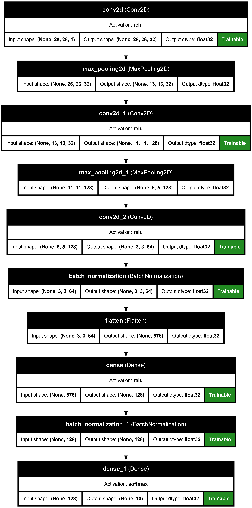
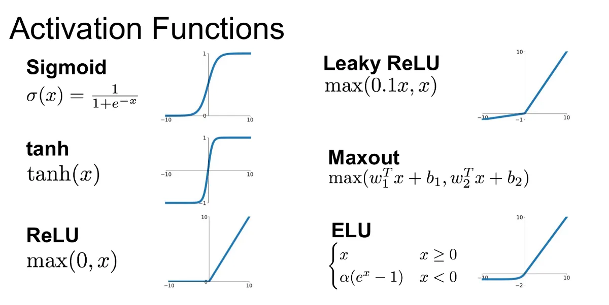

# Hluboké učení

Pro použí je potřeba si nainstalovat následující balíčky a používat python verze 3.9.

``` bash
pip3.9 install keras tensorflow pandas numpy pydot
```

Dále je potřeba mít povolený slouhý formát cesty (soubor longPaht.reg) a nainstalovaný program GraphViz (přiložený exe soubor).

## Dataset


Rozlišení každého vzorku 28 x 28 pixelů -> 784 bodů.
42 000 trénovacích vzorků
28 000 testovacích vzorků

Staženo z [https://www.kaggle.com/competitions/digit-recognizer/data?select=sample_submission.csv].

## Vizualizace modelu



## Aktivační funkce



Kód použitý z [https://github.com/gursky1/MNIST-Tensorflow-2].
