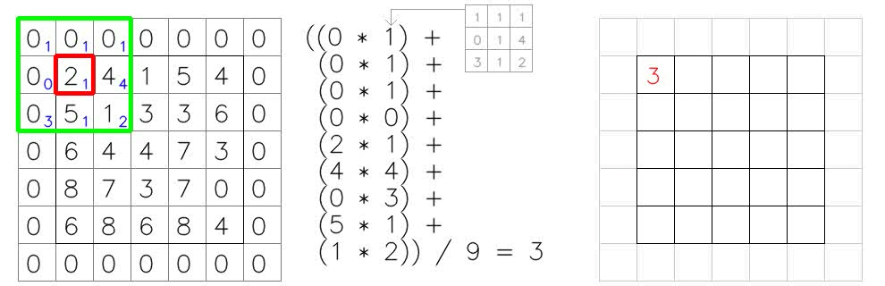

# Konvoluce

Ve zpracování obrazu slouží konvoluce jako filtr obrazu pro různé typy úkolů, jako je zvýraznění hran a rozmazání. V hlubokém učení jde o základní opraci.



## Python kód

Pro použití kódu je potřeba mít nainstalované potřebné balíčky pomocí následujícího příkazu:

```bash
pip3 install numpy scipy matplotlib
```

Obrázky použity z článku [Convolution: Image Filters, CNNs and Examples in Python & Pytorch](https://medium.com/@er_95882/convolution-image-filters-cnns-and-examples-in-python-pytorch-bd3f3ac5df9c), kde je možné nalézt více podrobností.
